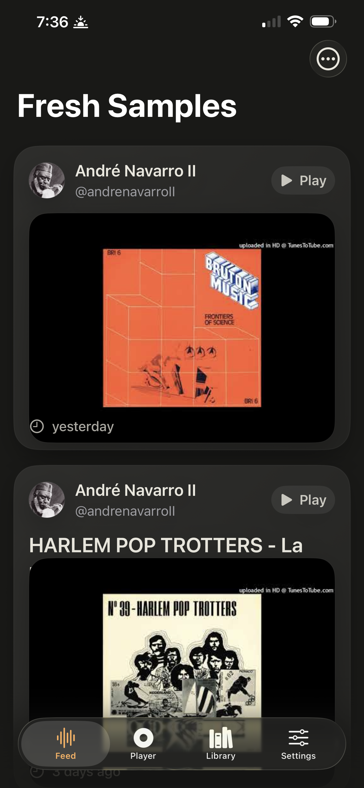
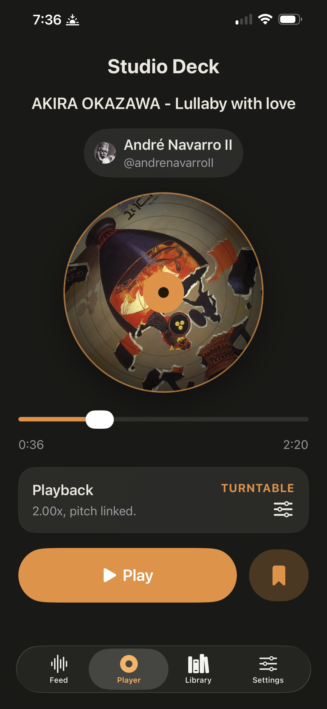
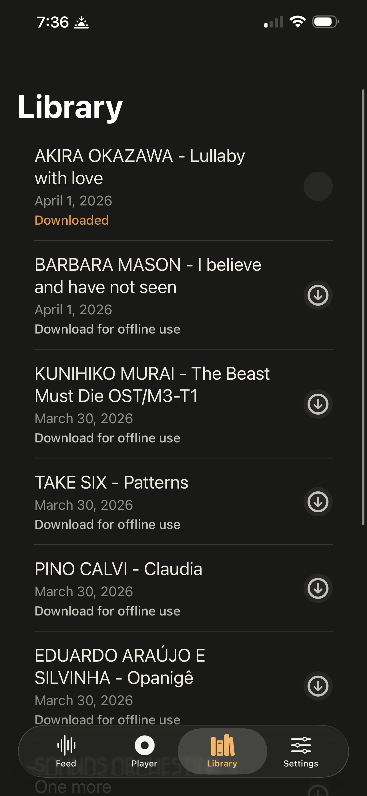
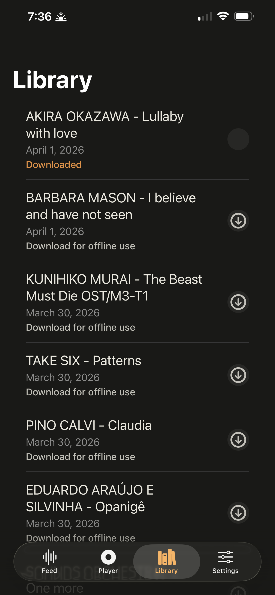

# Dream Crates

```text
           .-~~~~-.          .-~~~~-.
        .-( dream  )-.    .-( crates )-.
       (   ~  ~  ~   )    (   ~  ~  ~   )
        '-.________.-'     '-.________.-'

              dream crates
         samples, while you sleep
```

Dream Crates is a deepdream product: an internal iPhone app and FastAPI backend for discovering fresh sample uploads from YouTube, organizing them into a playable feed, and turning them into a studio-style listening experience with saving, downloading, offline playback, and evolving playback manipulation tools.

Current active work includes the new playback transposition modes. `Warp` and `Turntable` are now in the app and under active refinement, with ongoing work focused on polish, caching strategy, playback handoff, and end-to-end device validation.

## App Screens

| Fresh Samples | Studio Deck |
| --- | --- |
|  |  |

| Library | Library Downloaded |
| --- | --- |
|  |  |

## Project Progress

| Area | Status | Notes |
| --- | --- | --- |
| Foundation and repo scaffolding | Implemented | SwiftUI iOS app, FastAPI backend, deployment assets, local scripts, and device-first testing flow are all in place. |
| YouTube ingestion and feed | Implemented | Polling, dedupe, tagging, pagination, channel metadata decoration, and feed delivery are working. |
| Library and offline basics | Implemented | Save/unsave, local persistence, download storage, offline restore, and saved-library views are working. |
| Playback core | Implemented | Background audio, remote controls, scrubber, record animation, playback speed, and mode-aware playback are working. |
| Transposition modes | In progress | `Warp` and `Turntable` exist now, but they are still being tuned and validated as a work in progress. |
| Notifications and quiet hours | Partial | Registration, preference syncing, quiet-hour suppression, and backend dispatch scaffolding exist; full in-app notification handling is still incomplete. |
| Channel management | Partial | The backend supports device-specific tracked channel lists, but the iOS app does not yet expose channel management UI. |
| Production hardening | In progress | Media proxying, resolver fallback paths, Docker/Debian deploys, and smoke scripts exist; more end-to-end validation remains. |

## Current Capabilities

### Product snapshot

- deepdream-branded internal sample discovery product spanning iOS + backend
- Curated YouTube-channel ingestion focused on newly uploaded sample material
- Studio-style listening flow built around a `Feed`, `Player`, `Library`, and `Settings` tab layout
- Remote-first playback with local caching and offline fallback paths
- Lightweight tagging, library state, and notification preference sync

### iOS app

The iOS app lives in `ios/StudioSample`, is generated via XcodeGen, and targets iOS 17.

Current app behavior includes:

- `Feed` tab with recent-sample cards, pull-to-refresh, loading/empty states, and tap-to-play
- Context actions from the feed for downloading and saving/removing samples from the library
- Active-item highlighting and play/pause state surfaced directly in the feed
- `Player` tab with record artwork, spinning animation while playing, pause deceleration, progress scrubber, and current sample metadata
- `Library` tab showing saved samples ordered by most recently saved, including download state and quick download/remove actions
- `Settings` tab for notifications and quiet hours, plus remote preference bootstrap on load
- Configurable API base URL via environment / Info.plist, defaulting to `https://samples.dpdrm.com`

### Playback and audio behavior

The current player stack supports two playback/transposition styles:

- `Warp` mode:
  - Uses `AVAudioEngine` + `AVAudioUnitTimePitch`
  - Supports independent speed and transpose control
  - Supports transpose from `-12` to `+12` semitones
  - Uses local files first when available
  - Caches transient playback files locally for repeat playback
- `Turntable` mode:
  - Uses `AVPlayer`
  - Uses varispeed playback, so speed and pitch move together like a deck
  - Ignores separate transpose values by design
  - Works directly against resolved stream URLs

Additional playback capabilities:

- Speed control from `0.5x` to `2.0x`
- Background audio session support
- Lock-screen / remote transport controls
- Playback position scrubbing
- Resume behavior that restarts from the top when resuming near the end
- Preference persistence for playback mode, speed, and transpose values
- Playback handoff that preserves playhead position while switching engines/modes
- Preloading of nearby sample playback URLs to reduce taps-to-sound latency

### Transposition work in progress

The new transposition feature set is actively being implemented and refined. Current WIP areas include:

- Finalizing the dual-mode experience between `Warp` and `Turntable`
- Tightening the UX around mode switching while audio is already playing
- Validating local-cache behavior for warp playback on real devices
- Polishing the distinction between offline/local playback and streamed playback paths
- Expanding tests around playback-mode switching, persistence, and cached file reuse

### Library, downloads, and offline behavior

- Save/unsave is supported from the feed, player, and library flows
- Saved state is persisted locally so offline changes survive relaunch
- Pending saved-state changes reconcile back to the backend when it becomes reachable again
- Downloaded files are stored in Application Support under `DreamCratesDownloads`
- Relaunch restores downloaded-file state and uses local files for playback when present
- Warp playback can reuse a local transient cache even when a sample is not fully downloaded
- Saved samples are sorted by most recent save date in the library view

### Backend

The backend lives in `backend`, runs on FastAPI, and stores state in SQLite.

Current backend behavior includes:

- Polling recent uploads from tracked YouTube channels
- Deduping ingested items by `youtube_video_id`
- Backfilling older unseen uploads in batches
- Auto-backfill on the first feed request when the sample table is nearly empty
- Rule-based genre and tone tagging during ingestion
- Channel metadata decoration for title/avatar/handle
- Device registration and quiet-hours-aware notification preference storage
- Playback URL resolution and download preparation
- Backend media proxying so clients hit Dream Crates URLs instead of raw upstream media URLs
- Notification event logging for observability

Backend ingestion and metadata capabilities:

- Uses the YouTube Data API when configured
- Falls back to `yt-dlp` playlist scraping when API access is unavailable or fails
- Fetches channel metadata from YouTube API when possible
- Falls back to HTML scraping for channel metadata hydration when needed

Current storage tables include:

- `samples`
- `devices`
- `notification_events`
- `device_channels`

### Channel management

Current channel support includes:

- A shipped default tracked channel set
- `GET /v1/channels/defaults`
- `GET /v1/users/{device_id}/channels`
- `PUT /v1/users/{device_id}/channels`
- Per-device persisted tracked-channel lists in SQLite

Current limitation:

- The iOS app does not yet expose channel-management UI, so this capability is presently backend-only.

### Tagging

Tagging is currently rule-based, not ML-based.

Genre taxonomy:

- `ambient`
- `boom_bap`
- `cinematic`
- `drill`
- `house`
- `lo_fi`
- `phonk`
- `rnb`
- `techno`
- `trap`

Tone taxonomy:

- `aggressive`
- `dark`
- `dreamy`
- `eerie`
- `glossy`
- `gritty`
- `melancholic`
- `nostalgic`
- `uplifting`
- `warm`

### Notifications

- iOS stores notification and quiet-hour preferences locally
- iOS can request authorization and register for remote notifications
- APNs token registration is synced to the backend on a best-effort basis
- Backend supports per-device notification enablement plus quiet start/end hours
- Backend suppresses notifications during quiet hours
- Notification attempts are logged with statuses such as `suppressed_quiet_hours`, `skipped_missing_token`, and APNs delivery statuses

Current limitation:

- Full in-app handling of incoming push notifications is still incomplete.

## API Surface

Current top-level endpoints:

- `GET /healthz`
- `GET /v1/channels/defaults`
- `GET /v1/users/{device_id}/channels`
- `PUT /v1/users/{device_id}/channels`
- `GET /v1/samples`
- `POST /v1/poller/run-once`
- `POST /v1/admin/poller/backfill`
- `GET /v1/tags/taxonomy`
- `GET /v1/users/{device_id}/library`
- `PUT /v1/users/{device_id}/library/{sample_id}?saved=true|false`
- `POST /v1/playback/resolve`
- `POST /v1/download/prepare`
- `GET /v1/media/{sample_id}/{mode}`
- `HEAD /v1/media/{sample_id}/{mode}`
- `POST /v1/devices/register`
- `GET /v1/users/{device_id}/preferences`
- `PUT /v1/users/{device_id}/preferences`

Notable endpoint behavior:

- `GET /v1/samples` supports `limit`, `cursor`, and optional ISO-8601 `since`
- `/v1/media/...` proxies upstream media through the backend instead of returning raw upstream URLs directly
- Media proxying forwards `Range` and `If-Range` headers and supports `HEAD`
- `POST /v1/admin/poller/backfill` pages through older uploads until it inserts the requested limit or exhausts history
- Playback/download prepare responses include `expires_at` and `source`

## Repo Layout

- `ios/StudioSample`: SwiftUI iPhone app
- `backend`: FastAPI app, SQLite store, ingestion, tagging, resolver, APNs, tests
- `deploy/debian`: Debian deployment assets, `systemd` units, `nginx` config, env example
- `deploy/docker`: Docker deployment assets and env examples
- `docker-compose.yml`: local/server container orchestration
- `scripts`: environment checks and API smoke scripts
- `testing.md`: device-first validation policy
- `PLAN.md`: product milestones, acceptance criteria, and risks

## Architecture

```text
+------------------ iOS App (SwiftUI) ------------------+
| Feed tab       -> recent sample discovery             |
| Player tab     -> deck-style playback + mode control  |
| Library tab    -> saved samples + downloads           |
| Settings tab   -> notifications + quiet hours         |
|                                                        |
| Local persistence:                                    |
| - saved-state queue                                   |
| - playback mode / speed / transpose                   |
| - notification prefs + APNs token                     |
| - downloaded MP3 files + transient playback cache     |
+-----------------------+--------------------------------+
                        |
                        | REST
                        v
+------------------ Backend (FastAPI) -------------------+
| /v1/samples                                            |
| /v1/users/{deviceId}/channels                          |
| /v1/users/{deviceId}/library                           |
| /v1/playback/resolve                                   |
| /v1/download/prepare                                   |
| /v1/media/{sampleId}/{mode}                            |
| /v1/devices/register                                   |
| /v1/users/{deviceId}/preferences                       |
| /v1/poller/run-once                                    |
| /v1/admin/poller/backfill                              |
|                                                        |
| Services: YouTube poller, rules tagger, resolver,      |
| media proxy, channel metadata catalog, APNs dispatch,  |
| device registration, SQLite persistence                |
+-----------------------+--------------------------------+
                        |
                        v
+---------------- External Services ---------------------+
| YouTube Data API                                      |
| yt-dlp fallback                                       |
| Optional APNs                                         |
| Optional command-based media resolver                 |
+-------------------------------------------------------+
```

## Local Development

### Prerequisites

- `python3`
- `xcodebuild`
- `xcodegen`
- `xcrun`
- `yt-dlp` and `ffmpeg` if you want full local resolver behavior outside Docker

Quick environment check:

```bash
./scripts/doctor.sh
```

### Backend quickstart

```bash
cd backend
python3 -m venv .venv
source .venv/bin/activate
pip install -e .[dev]
cp .env.example .env
uvicorn app.main:app --reload
```

### Docker quickstart

```bash
cd /Users/kell/Cloud/dev/dream-crates
cp deploy/docker/dream-crates.env.example deploy/docker/dream-crates.env
docker compose up --build -d
```

### iOS quickstart

```bash
cd ios/StudioSample
xcodegen generate
xcodebuild -project 'dream crates.xcodeproj' -scheme StudioSampleApp -destination 'generic/platform=iOS' build
```

Useful iOS commands:

```bash
cd ios/StudioSample
./scripts/list-destinations.sh
./scripts/test-device.sh
DEVICE_NAME=kellcd ./scripts/install-device.sh
DEVICE_NAME='spacepad air' ./scripts/install-device.sh
DESTINATION_ID=<simulator-id> ./scripts/test-simulator.sh
```

## Environment Configuration

The backend reads `STUDIO_*` values from `backend/.env`.

```bash
# YouTube ingestion
STUDIO_YOUTUBE_API_KEY=
STUDIO_YOUTUBE_BASE_URL=https://www.googleapis.com/youtube/v3

# Storage
STUDIO_STORAGE_PATH=data/studiosample.db

# APNs push
STUDIO_APNS_ENABLED=false
STUDIO_APNS_TOPIC=com.dreamcrates.studiosample
STUDIO_APNS_KEY_ID=
STUDIO_APNS_TEAM_ID=
STUDIO_APNS_PRIVATE_KEY_PATH=
STUDIO_APNS_USE_SANDBOX=true

# Playback/download resolver
STUDIO_RESOLVER_COMMAND=
STUDIO_RESOLVER_FALLBACK_URL=https://www.soundhelix.com/examples/mp3/SoundHelix-Song-1.mp3
STUDIO_RESOLVER_TTL_SECONDS=3600
```

Resolver contract:

- `STUDIO_RESOLVER_COMMAND` can reference `{video_id}`, `{sample_id}`, and `{mode}`
- The command must print JSON with `url` and may also include `expiresAt`, `source`, and `headers`
- If resolution fails, the backend falls back to `STUDIO_RESOLVER_FALLBACK_URL`

## Deployment

The repo includes two deployment paths:

- Docker deployment via `deploy/docker` and `docker-compose.yml`
- Debian single-node deployment via `deploy/debian`

Docker notes:

- The Docker image includes `yt-dlp` and `ffmpeg`
- `deploy/docker/dream-crates.env.example` prewires the resolver command to `backend/scripts/resolve_media_url.py`

Debian deployment includes:

- `dream-crates-api.service`
- `dream-crates-poller.service`
- `dream-crates-poller.timer`
- `nginx/dream-crates.conf`

## Testing

This repo follows a device-first workflow. See `testing.md` for the full policy.

Representative coverage currently includes:

- backend API and resolver behavior
- poller dedupe and backfill behavior
- rule-based tagging
- saved-state persistence across relaunch
- downloaded-file restore
- playback preference persistence
- warp-cache reuse and local-file precedence
- playback mode switching between turntable and warp engines
- notification preference persistence

## Known Gaps

- The app and project naming still mixes `Dream Crates` and `StudioSample` in some places
- Channel-management UI is not yet exposed on iOS
- Push delivery is only partially validated end to end
- Library state is still effectively shared at the sample row level in backend storage
- Resolver quality still depends on environment configuration and fallback behavior
- The new transposition modes are real and usable, but still actively being refined

## Source of Truth

- `PLAN.md` captures product direction, milestones, and risks
- `testing.md` captures the preferred validation workflow
- the codebase itself is the source of truth for current shipped capabilities
